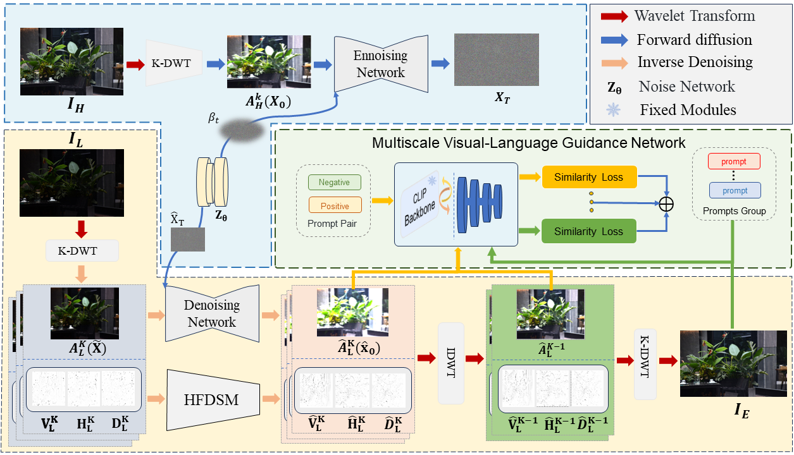
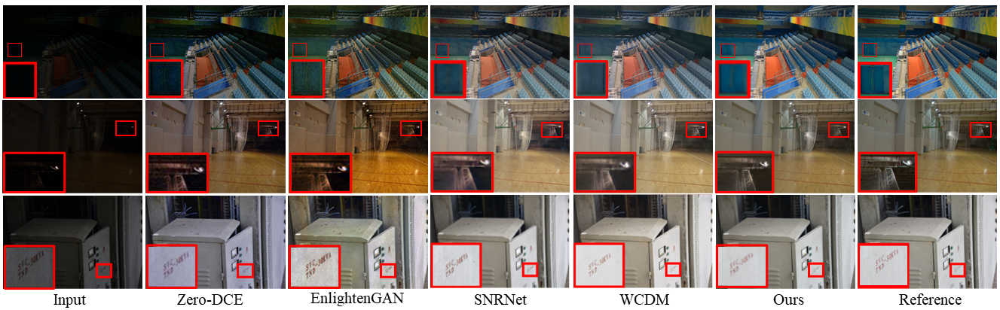

# Low-light Image Enhancement via CLIP-Fourier Guided Wavelet Diffusion [[Paper]](https://arxiv.org/abs/2401.03788).
<h4 align="center">Minglong Xue<sup>1</sup>, Jinhong He<sup>1</sup>, Yanyi He<sup>1</sup>, Zhipu Liu<sup>1</sup>, Wenhai Wang<sup>2</sup></center>, Mingliang Zhou<sup>3</sup></center>
<h4 align="center">1.Chongqing University of Technology
<h4 align="center">2.The Chinese University of Hong Kong
<h4 align="center">3.Chongqing University</center></center>

## Introduction
In this repo, we propose a novel and robust low-light image enhancement method, named CFGW. Extensive experiments on publicly available real-world benchmarks show that our method outperforms existing SOTA methods quantitatively and visually, maximizing image restoration similar to normal images.
For more details, please refer to our [paper link](https://arxiv.org/abs/2401.03788)


## Project Setup
 Clone Repo
 ```
 git clone https://github.com/He-Jinhong/CFWD.git
 cd CFWD  
 ```
Create Conda Environment and Install Dependencies:
```
pip install -r requirements.txt
```


## Download the raw training and evaluation datasets

[[Google Drive]](https://drive.google.com/drive/folders/1yAp7c-fQhU_KQkK7xk1KZ4YKAywwo-2z?usp=drive_link)

## Pre-trained Models 
You can downlaod our pre-training prompts and pre-training models from [[Google Drive]](https://drive.google.com/drive/folders/16tWuT7bVzQin2eiagsMByc-KN5UIQUho?usp=drive_link) 

## Quick Inference
Before performing the following steps, please download our pretrained model first.
You need to modify  ```test.py and datasets.py``` according to your environment and then
```
python test.py
```

## Train
Note that you will need to download our pre-training prompts
The directory structure will be arranged as:
```
pretrain_models
   |-prompt_pretrain
       |- pre_prompt_pair.pth
   |-pretrain_model.pth.tar
```
Then, You need to modify ```train_clip.py and datasets.py``` slightly for your environment, and then
```
python train_clip.py  
```

## Results on Low-light Image Enhancement


## Citation
```
@article{xue2024low,
  title={Low-light Image Enhancement via CLIP-Fourier Guided Wavelet Diffusion},
  author={Xue, Minglong and He, Jinhong and He, Yanyi and Liu, Zhipu and Wang, Wenhai and Zhou, Mingliang},
  journal={arXiv preprint arXiv:2401.03788},
  year={2024}
}
```

## Acknowledgement
Our underlying network comes from previous works: [WCDM](https://github.com/JianghaiSCU/Diffusion-Low-Light.git). We thanks the authors for their contributions.
